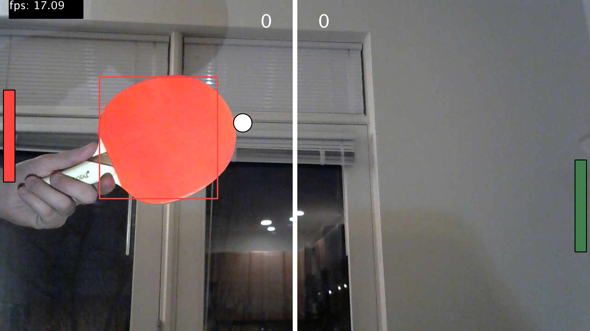

# video_pong
Pong game that uses OpenCV colored blob detection to control the game via a webcam.

# About this project

This Processing sketch uses the OpenCV library to track two colored ping pong paddles and uses their positions in the camera view to control a game of Pong. This allows two people to play the game using the ping pong paddles as "controllers." This is meant to be installed as showh in [this diagram](Sketches/installationDiagram.png)
